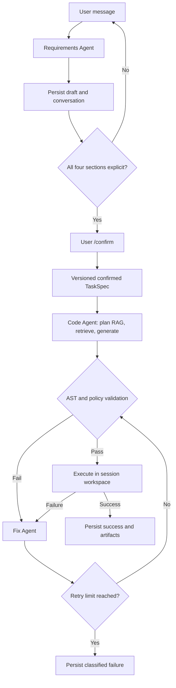

[中文](README_zh.md) | English

# Documentation-Grounded Code Agent

A runnable LangGraph project that turns private SDK/API documentation and a
multi-turn conversation into an executable Python automation. LiteLLM provides
a unified model layer across OpenAI, Anthropic, Gemini, Azure, Ollama,
OpenRouter, and other providers. The example uses a neutral record SDK and
contains no product- or scenario-specific names.

This is a lightweight first release, but the workflow is complete: requirements
are clarified and confirmed, documentation is retrieved before generation, code
is statically checked and executed, failures are classified and repaired, and
the whole session is persisted to files.

## What it does

The three agent stages are:

1. **Requirements Agent** — incrementally builds a typed `TaskSpec`, asks at most
   two essential questions per turn, and waits for explicit confirmation.
2. **Code Agent** — plans RAG queries, retrieves local documentation, generates a
   complete Python script, and submits it to deterministic validation.
3. **Fix Agent** — classifies a validation/runtime failure, retrieves targeted
   documentation, regenerates the complete script, and stops at a hard retry cap.

Execution is a deterministic workflow operation, not a fourth LLM agent.



## Prompt vs. hardcoded boundary

The model makes semantic judgments; Python code owns invariants and side
effects. This boundary prevents a prompt response from bypassing the workflow.

| Capability | Prompt/LLM | Hardcoded Python |
|---|---:|---:|
| Interpret conversation and propose a `TaskSpec` patch | Yes | Validates allowed fields and Pydantic types |
| Decide which questions are most useful | Yes | Maximum two; deterministic fallback questions |
| Claim a requirements section is confirmed | Proposes | Verifies required content and controls phase transition |
| Decide when code generation starts | No | Only `/confirm` from an eligible persisted phase |
| Plan documentation queries | Yes | Executes local search, deduplicates, applies top-k/context limits |
| Generate or repair Python | Yes | Sanitizes, parses AST, checks imports/calls/paths |
| Execute code and classify concrete failure | No | Subprocess timeout, safe env, return-code/error classification |
| Decide whether another repair is allowed | No | Fixed retry counter and conditional LangGraph edge |
| Save/resume/reset sessions and artifacts | No | Atomic JSON writes, snapshots, recoverable archive reset |

Prompts live in `src/code_agent/prompts.py`. The control plane is primarily in
`requirements_agent.py`, `orchestrator.py`, `validation.py`, `runner.py`, and
`session_store.py`.

## Install

Python 3.10 or newer is required.

```bash
python -m venv .venv
source .venv/bin/activate
pip install -e '.[dev]'
cp config.example.yaml code_agent.yaml
cp .env.example .env
```

## Model configuration

YAML is the recommended configuration entry. `model` uses LiteLLM's
`provider/model` convention. Each Agent can use a different model, URL, key,
timeout, and retry count:

```yaml
# code_agent.yaml
models:
  defaults:
    timeout: 120
    max_retries: 2

  requirements:
    model: anthropic/claude-sonnet-4-5
    api_base: https://requirements.example/v1
    api_key_env: REQUIREMENTS_API_KEY

  code:
    model: openai/gpt-5
    api_base: https://code.example/v1
    api_key_env: CODE_MODEL_API_KEY
    timeout: 180

  fix:
    model: ollama/qwen2.5-coder
    api_base: http://localhost:11434
    max_retries: 1
```

Keep secrets in the sibling `.env`, which the CLI loads automatically without
shell `export` commands:

```dotenv
REQUIREMENTS_API_KEY=...
CODE_MODEL_API_KEY=...
```

`code-agent` automatically discovers `./code_agent.yaml`. Select another file
explicitly with:

```bash
code-agent --config configs/development.yaml --session demo
```

The `.env` file is resolved beside the selected YAML file. `code_agent.yaml`
and `.env` are gitignored; commit `config.example.yaml` and `.env.example`, not
real credentials. A literal YAML `api_key` is supported for controlled local
use, but `api_key_env` is recommended for public repositories.

Configuration precedence, from highest to lowest, is:

1. role-specific YAML (`models.requirements`, `models.code`, `models.fix`);
2. YAML `models.defaults`;
3. role-specific environment variables;
4. global `CODE_AGENT_*` environment variables;
5. built-in timeout and retry defaults.

Environment-only configuration remains supported for deployments. The role
prefixes are `CODE_AGENT_REQUIREMENTS_*`, `CODE_AGENT_CODE_*`, and
`CODE_AGENT_FIX_*`, with fields `MODEL`, `API_BASE`, `API_KEY`, `TIMEOUT`, and
`MAX_RETRIES`. Provider-native credentials such as `OPENAI_API_KEY`,
`ANTHROPIC_API_KEY`, `GEMINI_API_KEY`, and `OPENROUTER_API_KEY` are also read by
LiteLLM after `.env` is loaded.

Model traffic ignores process-wide proxy variables by default. Set
`CODE_AGENT_TRUST_ENV=true` only when the provider must use `HTTP_PROXY`,
`HTTPS_PROXY`, or `ALL_PROXY`.

### Model configuration is not CLI-only

The CLI calls the public configuration loader and `create_agent_models()`
factory, but Python callers can use the same YAML and `.env` files:

```python
from code_agent import create_agent_models, load_agent_model_settings

settings = load_agent_model_settings("code_agent.yaml")
with create_agent_models(settings) as models:
    requirements_text = models.requirements.complete(
        "You return plain text.", "Say hello."
    )
```

Or configure all three adapters directly without environment variables:

```python
from code_agent import AgentModelSettings, ModelSettings, create_agent_models

settings = AgentModelSettings(
    requirements=ModelSettings(
        model="anthropic/claude-sonnet-4-5",
        api_key="requirements-key",
    ),
    code=ModelSettings(
        model="openai/gpt-5",
        api_base="https://code.example/v1",
        api_key="code-key",
    ),
    fix=ModelSettings(
        model="ollama/qwen2.5-coder",
        api_base="http://localhost:11434",
    ),
)
models = create_agent_models(settings)
```

For tests or embedding in another application, any object implementing
`complete(system_prompt, user_prompt) -> str` satisfies `TextModel` and can be
passed directly to `CodeAgentOrchestrator`. Passing one `TextModel` preserves
the shorthand behavior of sharing it across all three stages; passing
`AgentModels(requirements=..., code=..., fix=...)` selects them independently.

## Run the interactive CLI

From the repository root:

```bash
code-agent --session demo
```

Describe one Python automation. The agent will ask focused questions until the
goal, inputs/outputs, constraints, and acceptance criteria are explicit. Review
the printed `TaskSpec`, then enter `/confirm`.

Useful commands:

```text
/show      current TaskSpec draft
/history   persisted requirements conversation
/confirm   snapshot the spec, generate, validate, run, and repair if needed
/reset     archive the session and start over
/exit      exit without losing the session
```

Resume with the same ID:

```bash
code-agent --session demo
```

If the process was interrupted during generation or execution, `/confirm`
retries from the existing confirmed `TaskSpec` without creating a new spec
version. Completed sessions are immutable; use `/reset` or a new session ID.

See `examples/requests.md` for a conversation using the bundled neutral SDK.

## Local RAG

Place `.md`, `.txt`, `.json`, or `.jsonl` documents under `knowledge/`. The
dependency-light retriever chunks them, builds character n-gram TF-IDF vectors,
adds lexical reranking, and returns source-tagged evidence. Both Code Agent and
Fix Agent first ask the model for one or two focused queries; Python performs the
actual searches and enforces context limits.

The included `code_agent_demo_sdk` acts like a small private SDK, but is local and
deterministic. Its documentation is in `knowledge/demo_record_sdk.md`, allowing a
fresh installation to demonstrate documentation-grounded API use without a
network service or proprietary data.

## Persisted session layout

```text
sessions/<session-id>/
├── session.json                         # latest conversation and workflow state
├── task_specs/task_spec_v1.json         # immutable confirmed requirement
├── retrieval/
│   ├── code_agent_round_001.json
│   └── fix_agent_round_001.json
├── runs/
│   ├── initial/{generated.py,validation.json,run.json,stdout.txt,stderr.txt}
│   └── fix_001/{generated.py,validation.json,run.json,stdout.txt,stderr.txt}
└── workspace/generated.py               # script executed in a stable workspace
```

`/reset` moves the old directory under `sessions/archives/`; it does not delete
the evidence. Session writes use a temporary file plus atomic replacement.

## Static checks and execution boundary

Before execution, the validator checks:

- valid Python syntax;
- imports against `TaskSpec.allowed_dependencies` and `allowed_apis`;
- known destructive filesystem/process calls;
- obvious writes to absolute paths.

The runner uses the current Python interpreter, a persistent per-session working
directory, a reduced child environment that excludes model credentials, captured
stdout/stderr, and a timeout.

This is **not an OS sandbox**. AST checks cannot prove arbitrary Python safe, and
generated code still has the current user's filesystem and network permissions.
Do not expose the runner as a public service or execute untrusted requests. For
that use case, replace `LocalPythonRunner` with a locked-down container or VM.

## Tests

```bash
pytest -q
```

The deterministic suite uses a fake model and covers multi-turn requirements,
confirmation gates, spec snapshots, retrieval, static policy checks, successful
execution, timeouts, failure classification, repair routing/limits, interruption
recovery, the interactive CLI, artifact persistence, and the example SDK.

## Project map

```text
src/code_agent/
├── config.py              # YAML/.env loading, validation, and precedence
├── requirements_agent.py  # conversational TaskSpec construction
├── code_agent.py          # LangGraph generation subgraph
├── fix_agent.py           # LangGraph repair subgraph
├── orchestrator.py        # top-level graph and hard state transitions
├── prompts.py             # every LLM-owned behavior
├── llm.py                 # LiteLLM adapter, settings, and public factory
├── retriever.py           # local index and ranking
├── knowledge_tools.py     # bounded multi-query RAG operation
├── validation.py          # deterministic AST/import/path policy
├── runner.py              # timeout-controlled subprocess execution
├── session_store.py       # atomic file persistence and versioning
├── artifacts.py           # evidence layout
├── schemas.py             # typed state and domain contracts
└── cli.py                 # interactive/resumable shell
```
