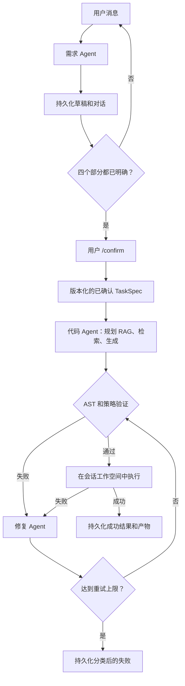

中文 | [English](README.md)

# 基于文档的代码生成 Agent

一个可运行的 LangGraph 项目，将私有 SDK/API 文档与多轮对话转化为可执行的 Python 自动化脚本。LiteLLM 提供统一的模型层，支持 OpenAI、Anthropic、Gemini、Azure、Ollama、OpenRouter 等多种提供商。示例使用中性的 Record SDK，不包含产品或场景特定名称。

这是一个轻量级的首次发布，但工作流是完整的：需求经过澄清和确认，文档在生成前被检索，代码经过静态检查和执行，失败被分类和修复，整个会话被持久化到文件。

## 功能概述

三个 Agent 阶段：

1. **需求 Agent** — 增量构建类型化的 `TaskSpec`，每轮最多提两个关键问题，等待用户明确确认。
2. **代码 Agent** — 规划 RAG 查询、检索本地文档、生成完整 Python 脚本，并提交至确定性验证。
3. **修复 Agent** — 分类验证/运行时失败、检索针对性文档、重新生成完整脚本，在重试上限处停止。

执行是确定性的工作流操作，而非第四个 LLM Agent。



## Prompt 与硬编码的边界

模型负责语义判断；Python 代码负责不变量和副作用。这一边界防止 prompt 响应绕过工作流。

| 能力 | Prompt/LLM | 硬编码 Python |
|---|---:|---:|
| 解释对话并提出 `TaskSpec` 补丁 | 是 | 验证允许字段和 Pydantic 类型 |
| 决定哪些问题最有价值 | 是 | 最多两个；确定性回退问题 |
| 声称需求部分已确认 | 提议 | 验证必需内容并控制阶段转换 |
| 决定何时开始代码生成 | 否 | 仅从合格的持久化阶段发出 `/confirm` |
| 规划文档查询 | 是 | 执行本地搜索、去重、应用 top-k/上下文限制 |
| 生成或修复 Python | 是 | 清理、解析 AST、检查导入/调用/路径 |
| 执行代码并分类具体失败 | 否 | 子进程超时、安全环境、返回码/错误分类 |
| 决定是否允许再次修复 | 否 | 固定重试计数器和条件 LangGraph 边 |
| 保存/恢复/重置会话和产物 | 否 | 原子 JSON 写入、快照、可恢复的归档重置 |

Prompt 定义在 `src/code_agent/prompts.py`。控制面主要在 `requirements_agent.py`、`orchestrator.py`、`validation.py`、`runner.py` 和 `session_store.py`。

## 安装

需要 Python 3.10 或更新版本。

```bash
python -m venv .venv
source .venv/bin/activate
pip install -e '.[dev]'
cp config.example.yaml code_agent.yaml
cp .env.example .env
```

## 模型配置

推荐使用 YAML 配置。`model` 使用 LiteLLM 的 `provider/model` 约定。每个 Agent 可以使用不同的模型、URL、密钥、超时和重试次数：

```yaml
# code_agent.yaml
models:
  defaults:
    timeout: 120
    max_retries: 2

  requirements:
    model: anthropic/claude-sonnet-4-5
    api_base: https://requirements.example/v1
    api_key_env: REQUIREMENTS_API_KEY

  code:
    model: openai/gpt-5
    api_base: https://code.example/v1
    api_key_env: CODE_MODEL_API_KEY
    timeout: 180

  fix:
    model: ollama/qwen2.5-coder
    api_base: http://localhost:11434
    max_retries: 1
```

密钥放在同级 `.env` 文件中，CLI 会自动加载，无需 shell `export`：

```dotenv
REQUIREMENTS_API_KEY=...
CODE_MODEL_API_KEY=...
```

`code-agent` 自动发现 `./code_agent.yaml`。通过参数指定其他配置文件：

```bash
code-agent --config configs/development.yaml --session demo
```

`.env` 文件从所选 YAML 文件同级目录解析。`code_agent.yaml` 和 `.env` 已被 gitignore；提交 `config.example.yaml` 和 `.env.example`，而非真实凭证。

配置优先级（从高到低）：

1. 角色特定 YAML（`models.requirements`、`models.code`、`models.fix`）；
2. YAML `models.defaults`；
3. 角色特定环境变量；
4. 全局 `CODE_AGENT_*` 环境变量；
5. 内置超时和重试默认值。

## 运行交互式 CLI

在仓库根目录下：

```bash
code-agent --session demo
```

描述一个 Python 自动化任务。Agent 会提出聚焦的问题，直到目标、输入/输出、约束和验收标准明确。查看打印的 `TaskSpec`，然后输入 `/confirm`。

常用命令：

```text
/show      当前 TaskSpec 草稿
/history   持久化的需求对话
/confirm   快照规格、生成、验证、运行，失败时修复
/reset     归档会话并重新开始
/exit      退出但不丢失会话
```

使用相同 ID 恢复：

```bash
code-agent --session demo
```

如果进程在生成或执行期间被中断，`/confirm` 会从现有已确认的 `TaskSpec` 重试，不会创建新的规格版本。已完成的会话不可变；使用 `/reset` 或新会话 ID。

参见 `examples/requests.md` 了解使用内置中性 SDK 的对话示例。

## 本地 RAG

将 `.md`、`.txt`、`.json` 或 `.jsonl` 文档放在 `knowledge/` 下。轻量级检索器对文档分块，构建字符 n-gram TF-IDF 向量，添加词汇重排序，返回带来源标签的证据。代码 Agent 和修复 Agent 会先让模型生成一到两个聚焦查询；Python 执行实际搜索并强制上下文限制。

内置的 `code_agent_demo_sdk` 充当小型私有 SDK，但完全本地且确定性。其文档在 `knowledge/demo_record_sdk.md`，使新安装可以在无网络服务或专有数据的情况下演示文档驱动的 API 使用。

## 持久化会话布局

```text
sessions/<session-id>/
├── session.json                         # 最新对话和工作流状态
├── task_specs/task_spec_v1.json         # 不可变的已确认需求
├── retrieval/
│   ├── code_agent_round_001.json
│   └── fix_agent_round_001.json
├── runs/
│   ├── initial/{generated.py,validation.json,run.json,stdout.txt,stderr.txt}
│   └── fix_001/{generated.py,validation.json,run.json,stdout.txt,stderr.txt}
└── workspace/generated.py               # 在稳定工作空间中执行的脚本
```

`/reset` 将旧目录移至 `sessions/archives/`；不会删除证据。会话写入使用临时文件加原子替换。

## 静态检查与执行边界

执行前，验证器检查：

- 有效的 Python 语法；
- 导入是否在 `TaskSpec.allowed_dependencies` 和 `allowed_apis` 范围内；
- 已知的破坏性文件系统/进程调用；
- 明显的绝对路径写入。

Runner 使用当前 Python 解释器、持久的每会话工作目录、排除模型凭证的精简子环境、捕获的 stdout/stderr，以及超时控制。

这**不是操作系统沙箱**。AST 检查无法证明任意 Python 是安全的，生成的代码仍具有当前用户的文件系统和网络权限。不要将 runner 暴露为公共服务或执行不可信请求。对于该用例，请将 `LocalPythonRunner` 替换为锁定的容器或虚拟机。

## 测试

```bash
pytest -q
```

确定性测试套件使用 fake model，覆盖多轮需求、确认门控、规格快照、检索、静态策略检查、成功执行、超时、失败分类、修复路由/限制、中断恢复、交互式 CLI、产物持久化和示例 SDK。

## 项目结构

```text
src/code_agent/
├── config.py              # YAML/.env 加载、验证和优先级
├── requirements_agent.py  # 对话式 TaskSpec 构建
├── code_agent.py          # LangGraph 生成子图
├── fix_agent.py           # LangGraph 修复子图
├── orchestrator.py        # 顶层图和硬状态转换
├── prompts.py             # 所有 LLM 负责的行为
├── llm.py                 # LiteLLM 适配器、设置和公共工厂
├── retriever.py           # 本地索引和排序
├── knowledge_tools.py     # 有界多查询 RAG 操作
├── validation.py          # 确定性 AST/导入/路径策略
├── runner.py              # 超时控制的子进程执行
├── session_store.py       # 原子文件持久化和版本化
├── artifacts.py           # 证据布局
├── schemas.py             # 类型化状态和领域契约
└── cli.py                 # 交互式/可恢复的 shell
```
